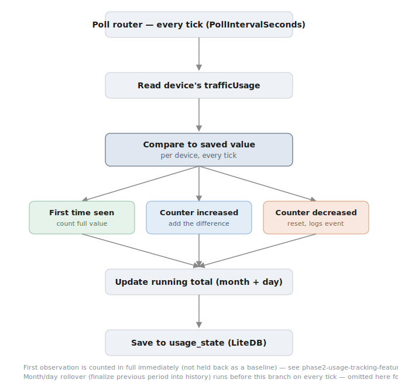

# NetPilot — Usage Tracking: as-built reference

**Status:** implemented, not yet deployed to the Proxmox CT. Superseded planning docs:
`phase2-usage-tracking-plan.md` (conceptual design) and `phase2-implementation-plan.md`
(build ticket) — kept for history. This doc describes what actually shipped, including
where it deviated from those plans during implementation.



## 1. Mechanism

No new HTTP call to the router. The Agent's existing reconciliation tick already polls
`admin/smart_network?form=game_accelerator` (`operation=loadDevice`) for speed-limit
enforcement — usage tracking reuses that same snapshot.

Per tick (`Worker.cs`):
```csharp
var snapshots = await reconciliationService.ReconcileAsync(routerProvider, stoppingToken);
await usageTrackingService.TrackAsync(snapshots, stoppingToken);
```

`PolicyReconciliationService.ReconcileAsync` returns the snapshot list it already fetched
(previously discarded); `UsageTrackingService.TrackAsync` consumes it directly.

Per device, per tick (`NetPilot.Core/Usage/UsageTrackingService.cs`):
1. Skip if `snapshot.Usage is null` (provider doesn't support usage tracking, or couldn't
   parse `trafficUsage` this tick).
2. If the calendar month or day rolled over since the last tick, finalize the previous
   period's total into `usage_history` / `usage_daily_history` and reset the running counter
   to 0 for the new period.
3. Compare the router's raw counter to the last saved value for that MAC:
   - **First time ever seen** → counted in full immediately.
   - **Increased or equal** → add the delta (`current − last`).
   - **Decreased** → treated as a reset (cause-agnostic — restart, daily rollover, whatever)
     — count the current value in full, and log an `ActivityEventType.UsageCounterReset`
     entry (visible in the dashboard's Activity log tab) so a reset is never silent.
4. Persist the updated `DeviceUsageState` row.

Reset detection is purely numeric (`current < last`) — it doesn't know or care why the
counter went down.

## 2. Deviation from the original plan: first observation

`phase2-usage-tracking-plan.md` and the initial implementation deliberately held back the
very first counter reading as a baseline only, on the theory that it might be a stale
lifetime/session total rather than usage from this period. **This was changed** after
building it — the user confirmed the router resets this class of counter often enough
(observed via the TP-Link app) that a device with real GB-scale usage should show that
usage immediately, not after two ticks.

Current behavior: the first-ever reading for a device is counted in full, using the exact
same math as a detected reset (just without logging a reset event, since nothing actually
reset — NetPilot just started watching).

**Open caveat, not yet resolved:** this rests on an assumption that hasn't been
live-verified. The TP-Link mobile app most likely reads TP-Link **Cloud**, not the same
local `trafficUsage` field NetPilot polls (`phase1-live-findings.md`) — so it's possible,
not confirmed, that the local counter behaves the same way. **Post-deploy check:** after
the first tick lands, look at day-one numbers per device. Sane values → assumption holds.
An implausible spike (e.g. a device's entire multi-week total dumped on day one) → the
local counter is actually long-lived, and first-observation should revert to baseline-only.
That's a one-line change in `UsageTrackingService.TrackAsync`.

## 3. Data model

Two new LiteDB collections, following the existing `IXStore`/`LiteXStore` pattern:

```
usage_state          — one row per MAC, mutable running state
  Mac (BsonId), LastRawCounterBytes, LastPollAtUtc,
  CurrentMonthKey, CurrentMonthBytes, CurrentDayKey, CurrentDayBytes

usage_history         — append-only, one row per Mac+Month (Id = "{Mac}|{MonthKey}")
usage_daily_history    — append-only, one row per Mac+Day   (Id = "{Mac}|{DayKey}")
```

Combined single counter (not split download/upload) — matches the single `trafficUsage`
field name. `TpLinkUsageParser` isolates the byte-vs-formatted-string unit assumption
(plain integer = bytes, with a formatted-string fallback) to one file, per the original
plan's open item #1 — still not live-confirmed.

## 4. Dashboard (Usage tab)

- **Period selector**: Month or Day, plus a date/month picker (native `<input type="month">`
  / `<input type="date">`). All comparisons are UTC — matches the UTC month/day keys the
  Agent writes.
- **Device selector**: a specific MAC, or all devices.
- **Total + per-device breakdown**: both built from the same `UsageQuery.BytesByDevice(...)`
  call (`NetPilot.Core/Usage/UsageQuery.cs`) — a pure function blending live state (current
  period) with finalized history (past periods), so the total and the sum of the visible
  rows can never disagree, including for a MAC no longer in the device list.
- Live-state entries are filtered to the requested period's own key before being counted —
  a device that's been offline since last month doesn't leak last month's frozen total into
  this month's view.

`RefreshFromRouterAsync` (the Devices tab's "Refresh from router" button) also calls
`UsageTrackingService.TrackAsync` on the snapshot it fetches, so a manual refresh updates
usage immediately rather than waiting for the next Agent tick. **Known tradeoff:** this
reintroduces a narrow double-count race — if the Agent's tick and a manual click land at
the same moment, both could read-modify-write `usage_state` concurrently and double-count
one delta. Accepted for a single-user home app: the failure mode is a slightly-inflated
usage number, not anything touching real router state.

## 5. Local development gotcha (fixed)

Agent and Web are separate processes that must share one LiteDB file
(`mvp-product-architecture.md`). In Docker this is guaranteed — both Dockerfiles set
`ENV NetPilot__DataDirectory=/data` and `docker-compose.yml` mounts the same named volume
for both services.

Running the two projects locally (e.g. two separate Rider run configurations, or two
`dotnet run` processes) without that env var previously fell back to `appsettings.json`'s
`"./data"`, which resolves **relative to each process's own working directory** —
`dotnet run`/Rider default that to the project's own folder. `src/NetPilot.Agent/data` and
`src/NetPilot.Web/data` ended up as two independent files, so a router connection (or any
data) saved through the Web dashboard was invisible to the Agent. Symptom: `Worker.cs`
stuck logging `"No router configured yet"` forever, even with a connection visibly saved
in the Web UI — because `TryConnectAsync` found the *Agent's own, empty* connection store,
never routing through it, so no reconciliation and no usage tracking ever ran.

**Fix:** both `appsettings.json` files (and the C# fallback in each `Program.cs`) now
default `DataDirectory` to `"../../data"` — relative to `src/NetPilot.Agent/` and
`src/NetPilot.Web/` respectively, this resolves to the same `<repo-root>/data/` folder for
both, since the two projects sit at the same depth under `src/`. Docker is unaffected: its
explicit `NetPilot__DataDirectory` env var still takes precedence over both `appsettings.json`
and the C# fallback.

## 6. Known limitations (carried forward, not fixed)

- **Missed polls**: usage between the last successful poll and a reset is lost — bounded,
  acceptable, not billing-grade.
- **Month/day boundary is UTC**, not the router's local timezone or an ISP billing cycle
  start date.
- **A device that goes offline and never returns** keeps its final period's total trapped
  in a live `usage_state` row that never finalizes to `usage_history` — not lost, just not
  surfaced in either the current or historical view.
- **`trafficUsage`'s exact unit is still not live-verified** against the real firmware —
  everything above assumes plain-integer-bytes, isolated to `TpLinkUsageParser` if wrong.
